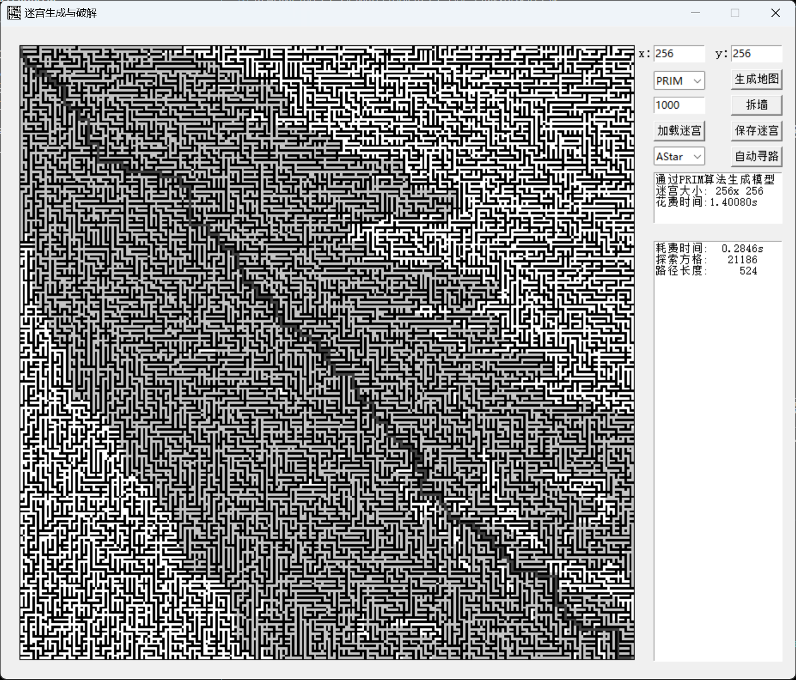
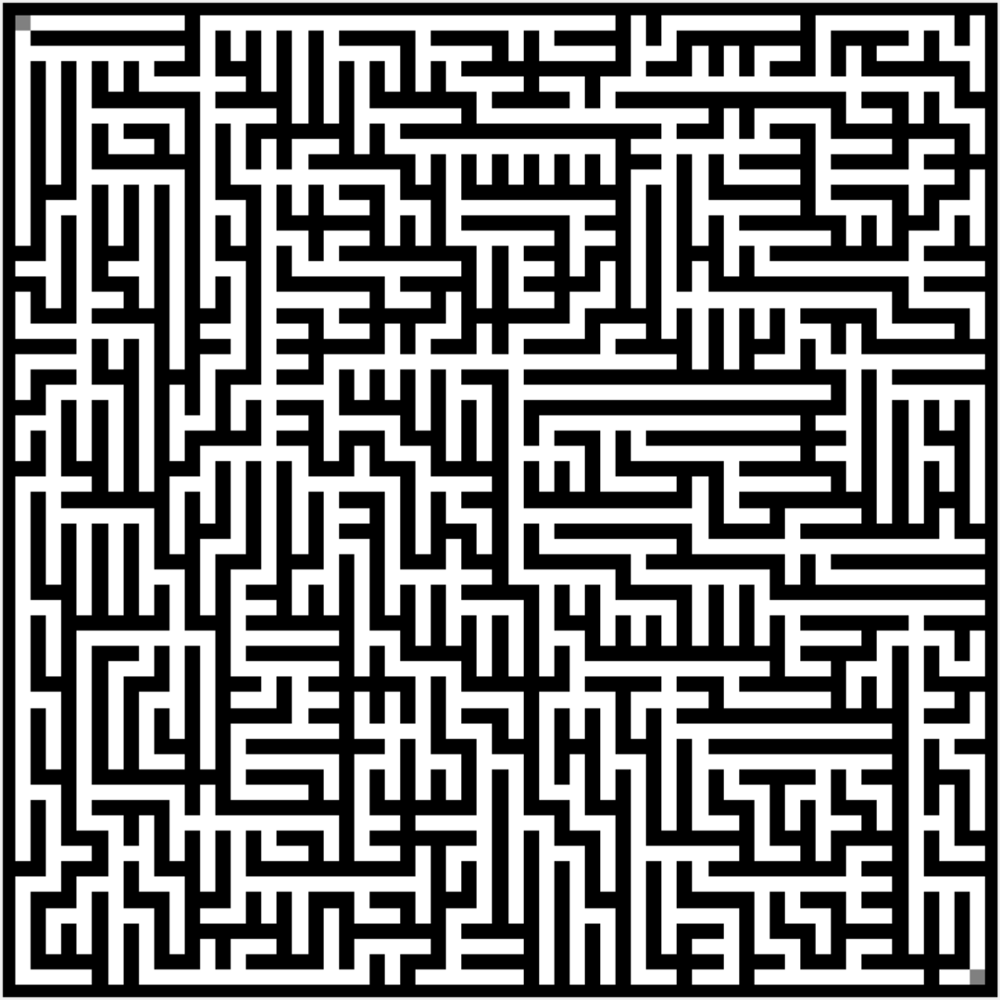

# MazeProblem

## 简单介绍一下

该项目不过是一个平平无奇的小作业，基于python3.8开发，目前提供两种迷宫生成算法与三种迷宫求解算法，希望对大家的学习有所帮助。

项目如果有后续的跟进将会声明，目前就这样吧~

效果图如下所示：

## 环境介绍

刚刚说了，这是python3.8，同时我们还包含了两个第三方库，这些我将会放在requirement.txt中。是的，我现在意识到它非常重要，因为跑别人代码没有它真的很容易环境冲突。

## 文件介绍

项目很简单，一共只有三个文件，所以如果是想要学习的朋友应该很容易可以梳理清楚文件的关系。

`ui.py` 是项目的UI设计以及运行入口，所有的逻辑都是基于此开发的；

`Generate.py` 是项目中负责生成迷宫的，提供了`DFS`、`PRIM`两种生成方式，具体的逻辑一会会介绍；

`solve.py` 是项目中负责迷宫求解的部分，提供了`DFS`、`BFS`、`A*`三种迷宫求解方案。
 
## 生成算法逻辑实现

该部分介绍一下两个迷宫生成算法的主要逻辑。

### DFS 生成迷宫

深度搜素算法构建迷宫。我在实现该算法的时候和网络上的方法略有出入，大体流程如下：

1. 首先构建迷宫大小的两个矩阵，分别位记录迷宫形状的`maze_map`和记录迷宫访问状态的`maze_state`；同时还有一个记录DFS状态的`memory`列表。
2. 将起点添加进上述三个空间中：
3. 当`memory`列表不为空时，开始循环：
   1. 如果`memory`最后一个元素可以向外扩展：即与该元素相邻的元素存在未被访问过的元素，则将该元素添加进入列表中，如果有多个未被访问过的元素，则随机选择一个进入，来确保迷宫的随机性。并将添加进来的元素的`maze_state`标记为1。
   2. 如果`memory`最后一个元素无法向外扩展，则将该元素从`memory`中弹出。

这里需要注意的时，如何判断一个元素是否可以向外扩展呢？这里的判断条件如下：

1. 不可以超出迷宫限定的大小范围；
2. 扩展的点不能被访问过
3. 被扩展的点不能联通两个两条路线，防止出现环；

通过`DFS`生成的迷宫图效果如下图所示:

### PRIM 生成迷宫

PRIM构建迷宫。该算法构建迷宫构建流程如下图所示：

1. 构建一个迷宫大小的深度为5的向量，分别包含访问标记、四周墙体的状态。同时，包含一个memory来记忆以及打通的墙体；
2. 将起点添加进去；
3. 当memory长度不为空的时候，开始循环：
   1. 随机从memory中抽取一个节点m；
   2. 获取节点m所有合法的探索方向；
   3. 如果探索方向合法且新的节点未被访问过则添加进入memory，并标记为访问过，否则弹出memory。

同样的，这里的合法的探索方向也有限制条件：

1. 不可以超出迷宫限定的大小范围；
2. 扩展的点不能被访问过

通过`PRIM`生成的迷宫图效果如下图所示:

## 求解路径算法逻辑实现

在完成了迷宫设计后，接下来开始设计求解方法。

### DFS 迷宫求解

DFS是经典的迷宫求解算法，通过深度搜索探索全部路径，直到到达终点，这在仅有一条通路的情况下是还不错的。但通常现实环境是复杂的，存在多条通路的，在这种情况下DFS很难获得最优路径。
接下来介绍DFS的实现流程：

1. 建立地图的标记坐标，以及存放以及走过位置的`memory`;
2. 开始循环：
   1. 如果当前坐标无法扩展新的坐标，则弹出；
   2. 如果当前坐标可以扩展新的坐标，则将新的坐标入栈，且新坐标的标志位设置为1；
   3. 若新的坐标为终点时，结束循环。

同样的，算法方向的选择也是核心问题之一：

1. 新的坐标未超出地图位置；
2. 新的坐标不是墙体且未被访问过。

### BFS 迷宫求解

BFS也是常用的迷宫问题求解算法，通过广度优先的方法，通常来说广度优先搜索在路径搜索中可以得到最优解。如果迷宫有且仅有唯一解，该算法所探索的格子一般远高于DFS探索的空间，但如果迷宫中有多个路径存在时，该算法可以获得最优解。接下来时BFS算法逻辑：

1. 建立地图的标记坐标，以及存放以及走过位置的`memory`，同时我们还需要一个存放每一次迭代的所有坐标的列表;
2. 开始循环：
   1. 对坐标列表中的所有位置进行迭代，将可以到达的坐标添加到新的坐标列表中，并更新`memory`和标志位；
   2. 检查是否到达终点，到达则跳出循环。

在方向的统计上，同BFS一样。

### A* 迷宫求解

DFS虽然可以求得最优路径，但由于其的复杂度极高，且遍历空间极大的问题，在实际使用中通常不被采用；A*算法是在其后的佼佼者，通过启发式搜索的方式，在程序运行的阶段，对于其当前位置的移动损耗和预计损耗作为评估指标，来实现剪枝的作用。其流程如下所示：

1. 建立地图的标记坐标、存放以及走过位置的`memory`、损耗优先队列`cost`;
2. 开始循环：
   1. 对`cost`最小的元素进行拓展；
   2. 如果拓展结果为空，则弹出；
   3. 如果拓展结果存在值，则计算新节点的`cost`，并添加入`cost`队列中。
   4. 检查是否到达终点，到达则跳出循环。

## 一些问题

1. 还有一些迷宫生成方法没有加入，如递归分割迷宫生成法。

2. 在UI输出坐标移动位置时，如果地图过大会导致页面卡死。